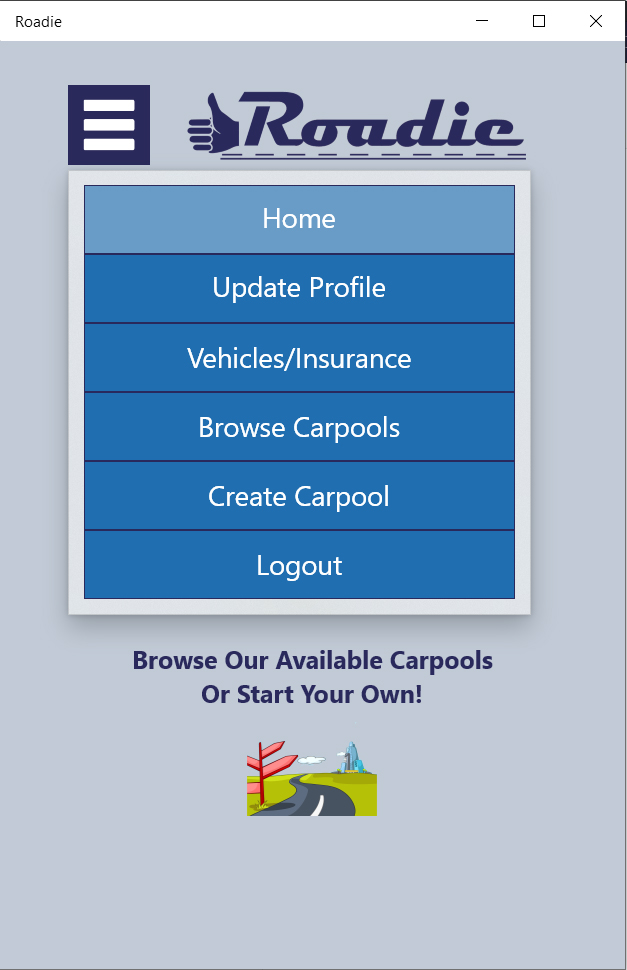

# Roadie_Universal_Windows_Project
 UWP program to interact with API

## Program Demonstration

## Program Features
* Login/Logout
* Input Validation
* Create new user
* Update user profile
* Browse carpools
* Create carpool
* Enter and update vehicle information
* Enter and update insurance information
* Interacts with API to connect to SQL Server database

## Program Screenshots

 
## Initial Design
Adode XD Prototype https://xd.adobe.com/view/17a63a42-805a-4480-945d-95d6471fee24-42f5/
